# Проект по тестированию сайта "wikipedia.org"
> <a target="_blank" href="https://www.wikipedia.org/">Ссылка на cайт</a>

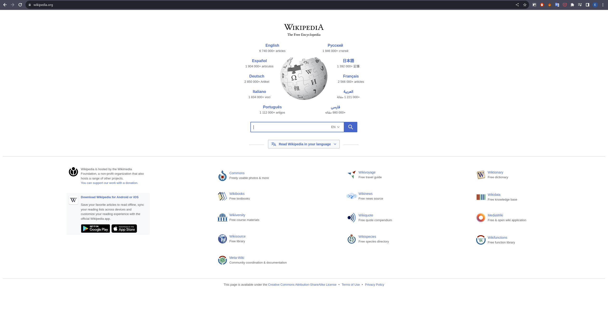

## Список проверок
### <a href='https://github.com/evgeniili0322/wikipedia-tests/tree/master/tests/web_ui'>Web-UI тесты</a>
 - Проверка текста главной страницы;
 - Проверка списка языков на главной странице;
 - Проверка перехода на страницу скачивания мобильных приложений;
 - Проверка перехода на страницу Wiktionary;
 - Проверка перехода на найденную статью;
 - Проверка выдачи списка найденных статей;
 - Проверка пустой выдачи поиска.

### <a href='https://github.com/evgeniili0322/wikipedia-tests/tree/master/tests/android_app'>Мобильные тесты</a>
 - Проверка начального экрана;
 - Проверка выдачи списка найденных статей;
 - Проверка перехода на найденную статью.

## Технoлoгии и инструмeнты
<p align="center">
<a href="https://www.python.org/"></a>
<a href="https://docs.pytest.org/"></a>
<a href="https://www.selenium.dev//"></a>
<a href="https://appium.io/docs/en/2.1/"></a>
<a href="https://aerokube.com/selenoid/"></a>
<a href="https://www.browserstack.com/"></a>
<a href="https://www.jenkins.io/"></a>
<a href="https://qameta.io/allure-report/"></a>
<a href="https://qameta.io/allure-report/"></a>
<a href="https://www.atlassian.com/software/jira"></a>
<a href="https://github.com/"></a>
<a href="https://web.telegram.org/"></a>
</p>

# Запуск автотестов в Jenkins
#### 1. Открыть <a target="_blank" href="https://jenkins.autotests.cloud/job/007-eugene0322-unit24/">проект</a>
#### 2. Выбрать пункт "**Build with Parameters**"
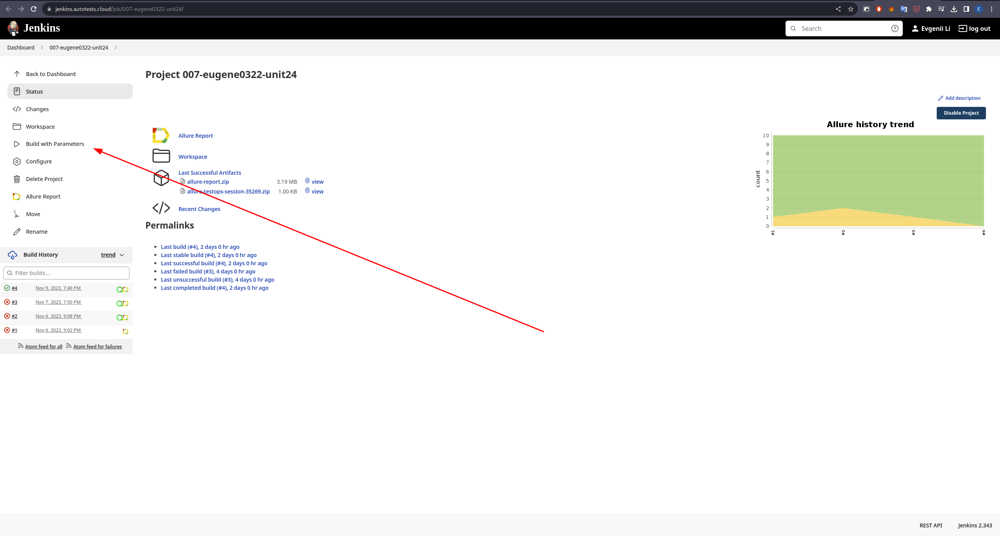
#### 3. Выбрать параметры сборки
* BROWSER (default: chrome) - выбор браузера на котором будут выполняьтся тесты
* BROWSER_VERSION (default: 100) - выбор версии браузера на котором будут выполняться тесты
* BROWSER_TIMEOUT (default: 4) - установка времени ожидания браузера
* MOBILE_TIMEOUT (default: 10) - установка времени ожидания мобильного приложения
#### 4. Нажать **Build**
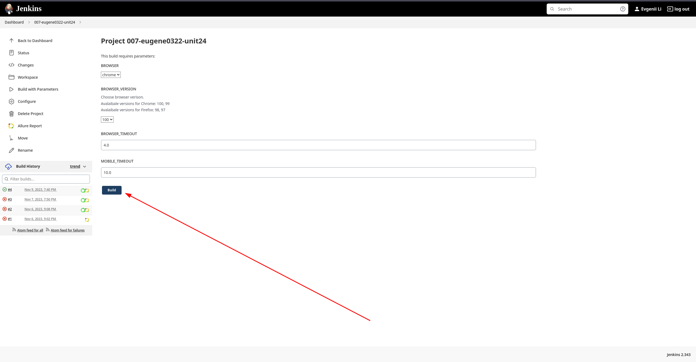
#### 5. Результат запуска сборки можно посмотреть в отчёте Allure
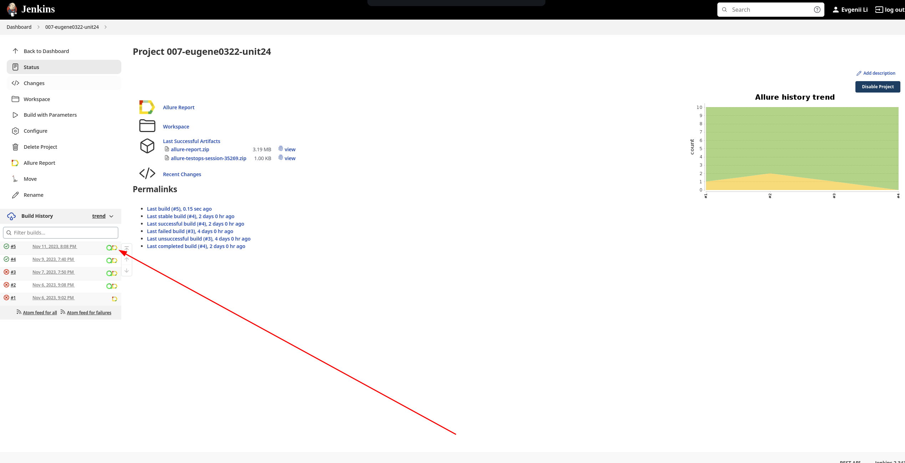

## Запуск автотестов локально
### Перед запуском:

Для запуска на удаленном сервере и browserstack в корне проекта необходимо создать .env файл со следующим содержанием:

    SELENOID_LOGIN='login'
    SELENOID_PASSWORD='password'
    BS_USER_NAME='browserstack_user_name'
    BS_ACCESS_KEY='browserstack_access_key'

Для получения кредов писать на почту evgeniili2203@gmail.com

- SELENOID_LOGIN - логин selenoid сервера
- SELENOID_PASSWORD - пароль selenoid сервера
- BS_USER_NAME - имя пользователя browserstack
- BS_ACCESS_KEY - ключ доступа к browserstack

### Создание виртуального окружения и установка зависимостей:
```bash
python -m venv venv
source venv/bin/activate
pip install -r requirements.txt
```
### Запуск:
Параметры запуска:

    web_context: local, remote (default: remote)
    app_context: bstack, local_real, local_emulator (default: bstack)
    browser: chrome, firefox (default: chrome)
    browser_version: 100, 99, 98, 97 (default: 100)
    browser_timeout: float (default: 4.0)
    mobile_timeout: float (default: 10.0)

- web_context - выбор контекста запуска web-ui тестов (локально, удаленно)
- app_context - выбор контекста запуска мобильных тестов (локально на реальном устройстве, локально на эмуляторе, на browserstack)
- browser - выбор браузера на котором будут выполнятся тесты
- browser_version - выбор версии браузера на котором будут выполнятся тесты
- browser_timeout - установка времени ожидания браузера
- mobile_timeout - установка времени ожидания мобильного приложения

#### Примеры запуска тестов
Запуск в браузере Chrome версии 100 на удаленном сервере для web ui тестов и на browserstack для мобильных тестов: 
```bash
browser_version=100 pytest tests
```

Запуск локально в браузере firefox для web ui тестов и локально на эмуляторе для мобильных тестов:
```bash
web_context=local browser=firefox app_context=local_emulator pytest tests
```
Примечание: для запуска мобильных тестов локально (на эмуляторе) необходимо в файле .env.local_real (.env.local_emulator) изменить UDID на ваше устройство и REMOTE_URL на вашу ссылку APPIUM сервера.

### Получение отчёта:
```bash
allure serve
```

## Allure Отчет
##### После прохождения тестов, результаты можно посмотреть в генерируемом Allure отчете.


##### Во вкладке Graphs можно посмотреть графики о прохождении тестов, по их приоритезации, по времени прохождения и др.
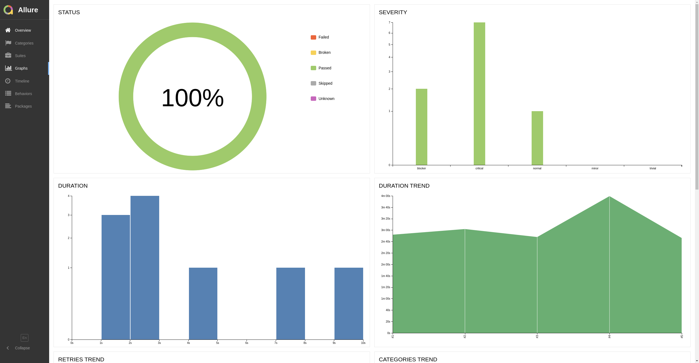

##### Во вкладке Suites находятся собранные тест кейсы, у которых описаны шаги и добавлены логи, скриншот и видео.
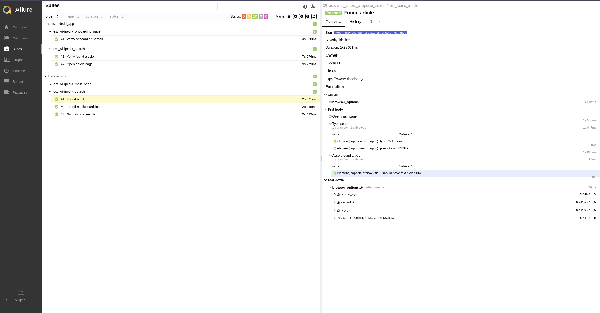

#### Пример видеозаписи прохождения теста
Web
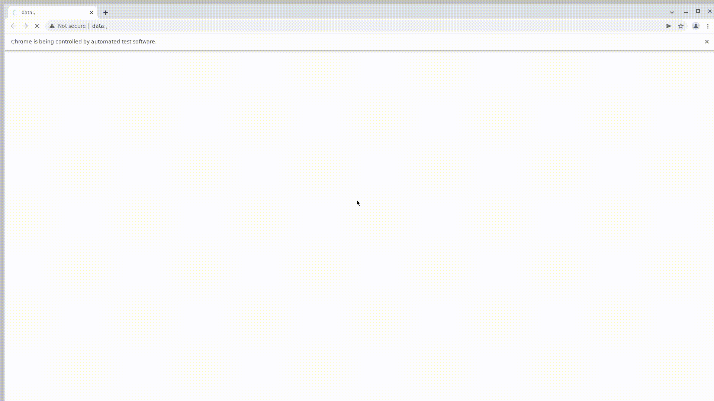
Mobile
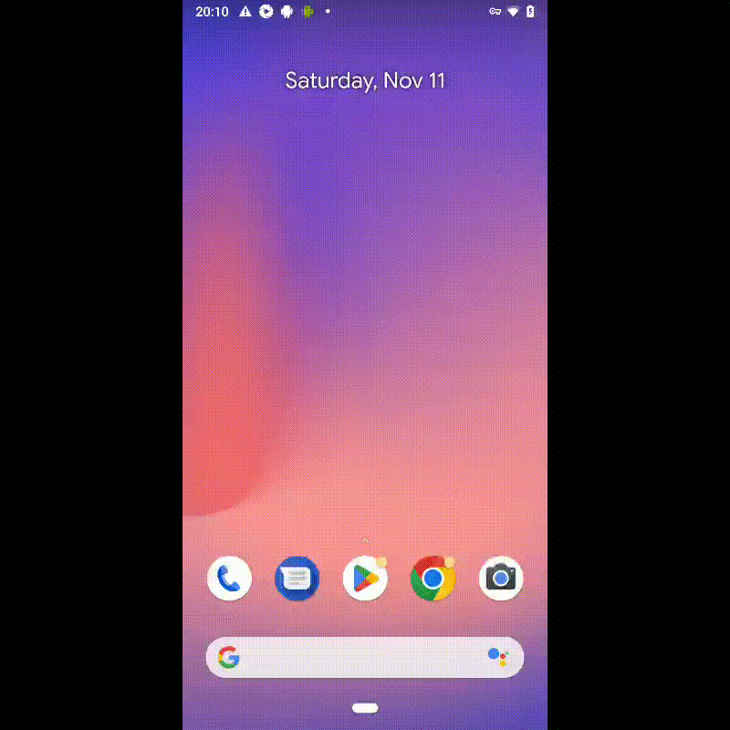

# Интеграция с Allure TestOps и Jira
#### Результаты прохождения тестов, а также сами тест-кейсы будут отправлены в Allure TestOps
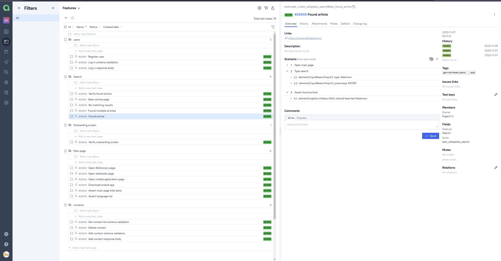
#### Также на основе результатов прохождения тестов будет сгенерирован дашборд
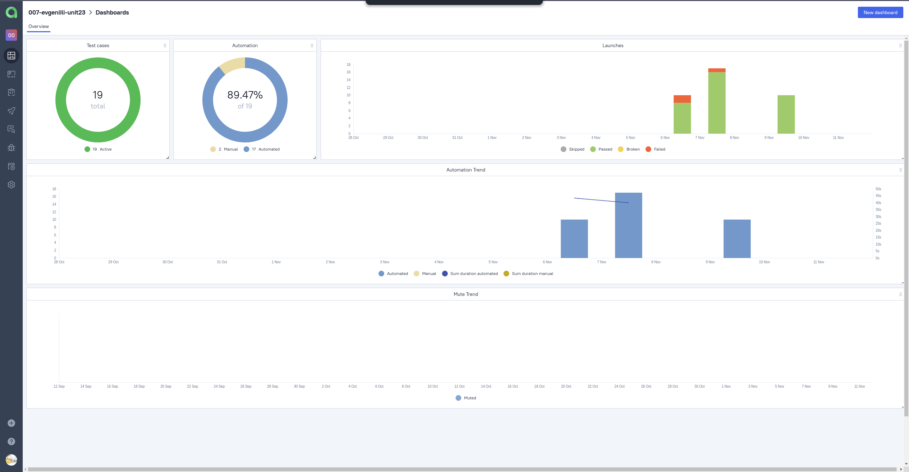
#### Все тест кейсы также могут быть прикреплены к задаче в Jira Software
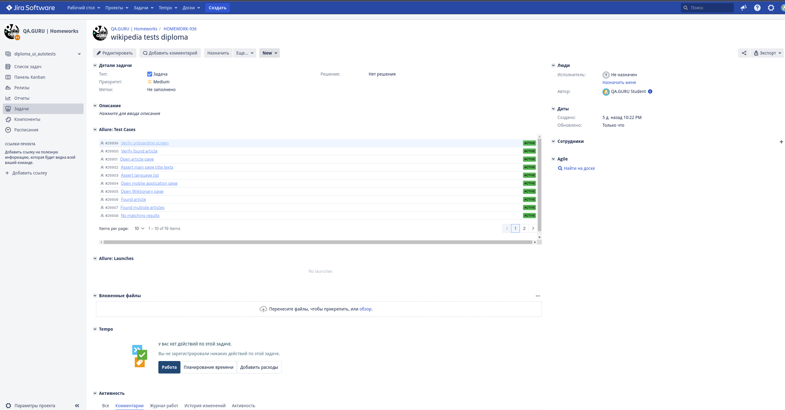

# Настроено автоматическое оповещение о результатах сборки Jenkins в Telegram-бот
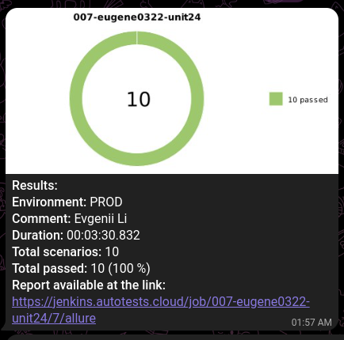
